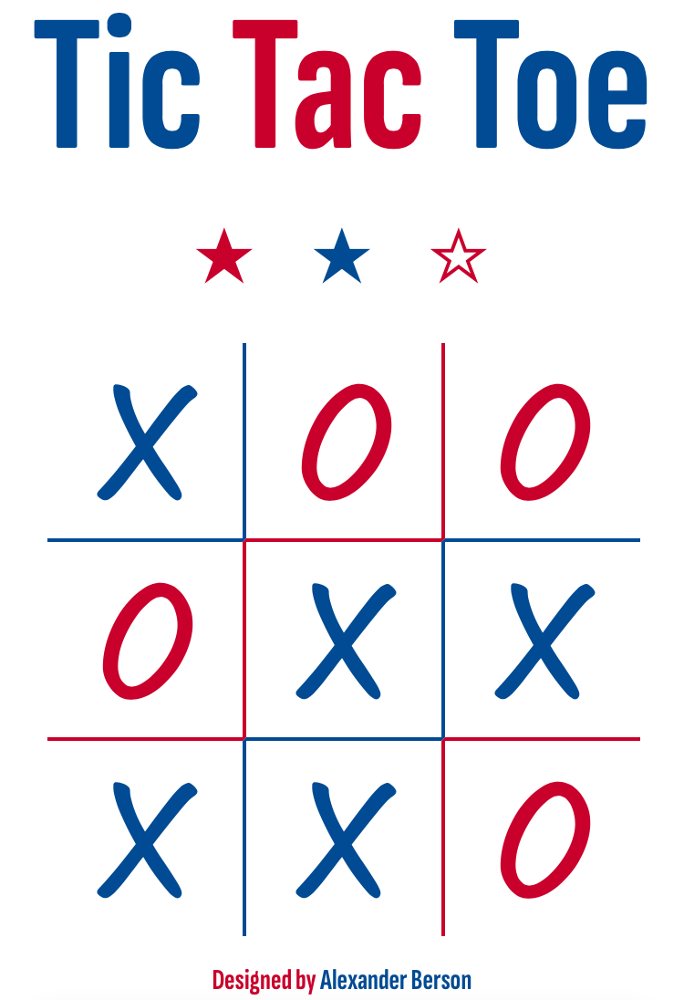

# Tic Tac Toe

Place three of your marks in a row.   
You can [play Tic Tac Toe against the AI online](https://alex-berson.github.io/tic-tac-toe/) or  

## Description

**Tic-tac-toe**, also known as **Noughts and Crosses** or **Xs and Os**, is a paper-and-pencil game for two players who take turns placing marks (Xs for the first player and Os for the second) on a 3×3 grid. The first player to get three matching marks in a row, either horizontally, vertically, or diagonally, wins. If all squares are occupied but neither player has three marks in a row, the game is a tie.

## Screenshot

  

## License

Copyright &copy; 2024 Alexander Berson. This project is licensed under the [MIT license](LICENSE.txt "MIT License").

